# Music Store Data Analysis

1. Executed complex SQL queries on records in PostgreSQL , driving 25% improvement in insights on sales trends and customer behavior.
2. Optimized relational data management with 35% faster query performance , enhancing data retrieval across key tables and enabling 20% quicker report generation

## Output

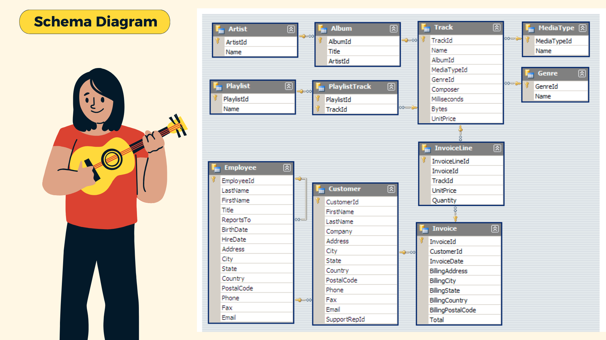

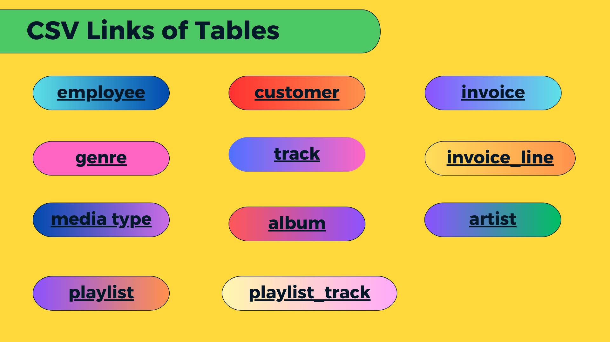

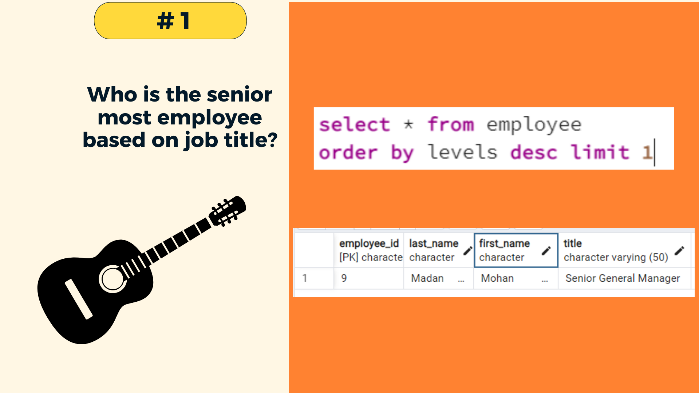

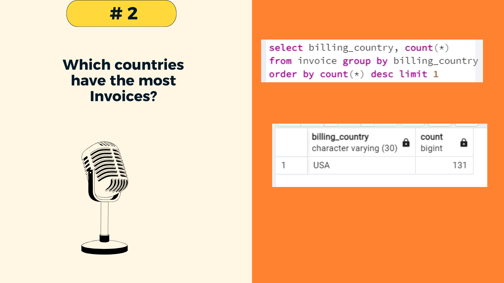

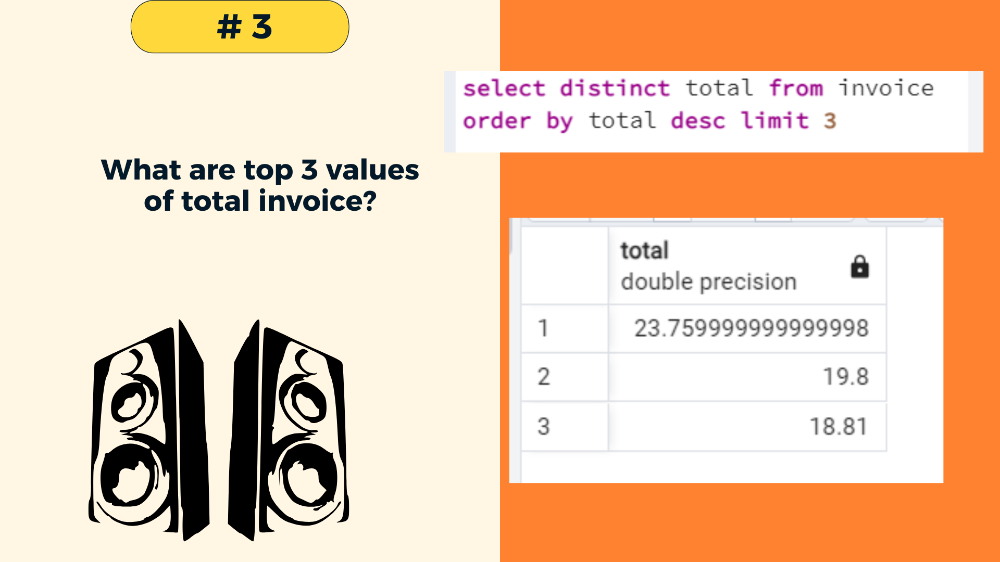

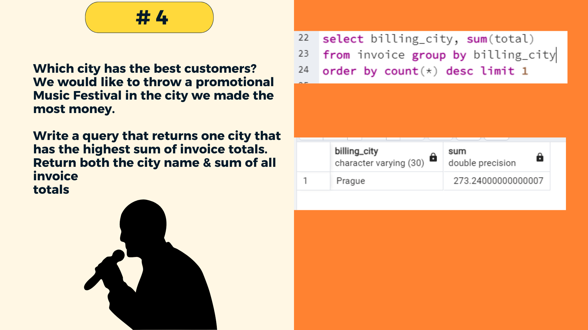

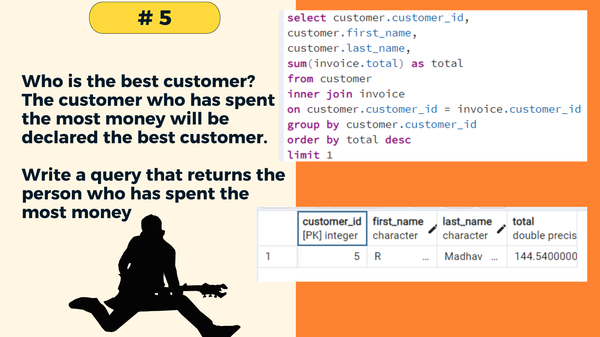

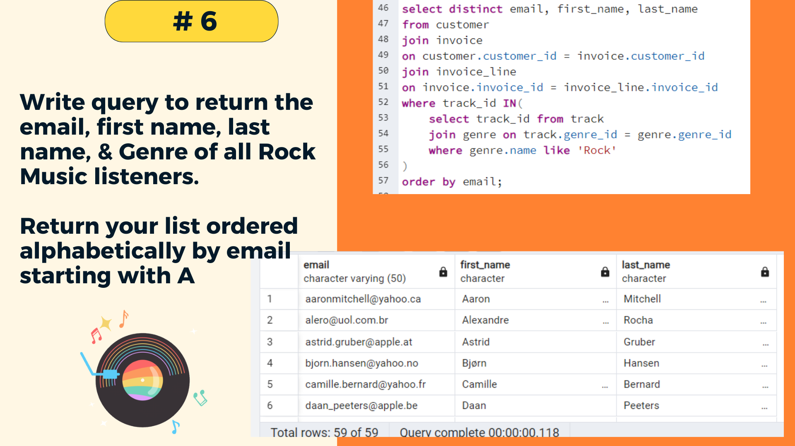

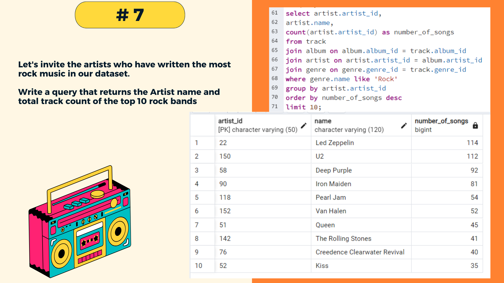

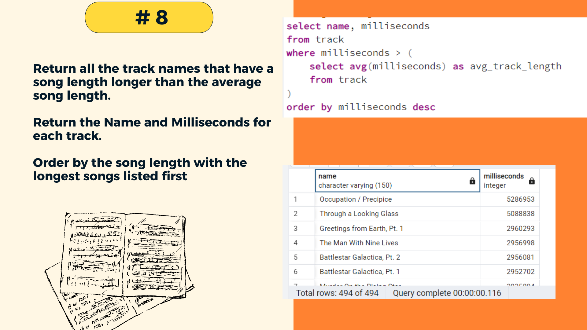

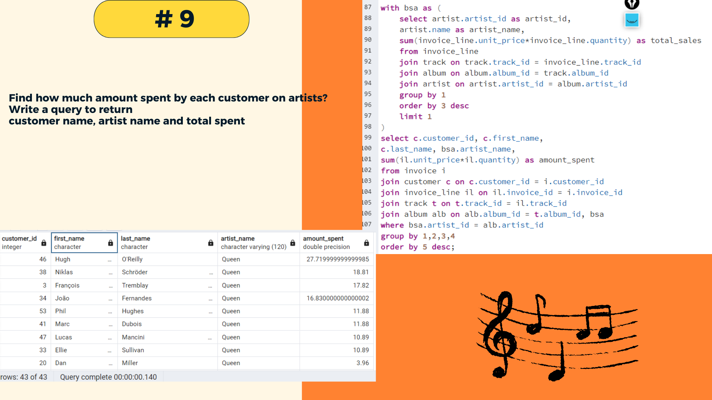

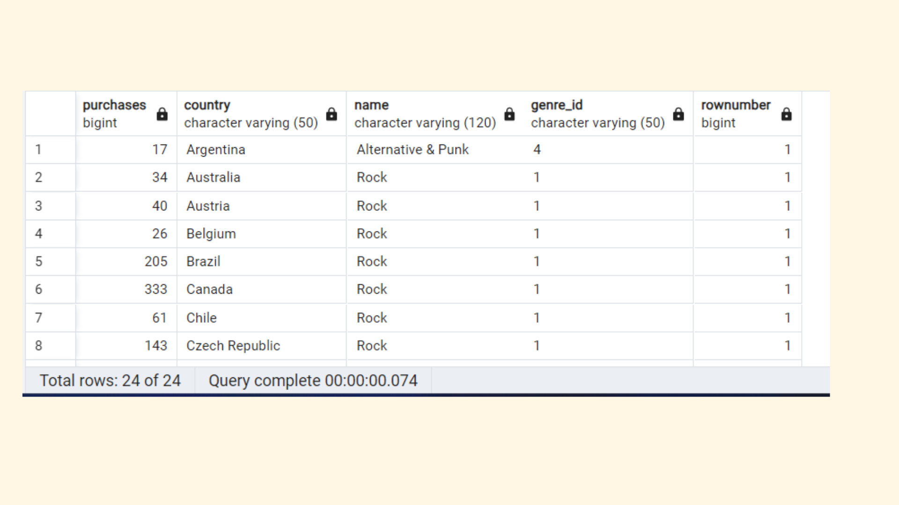

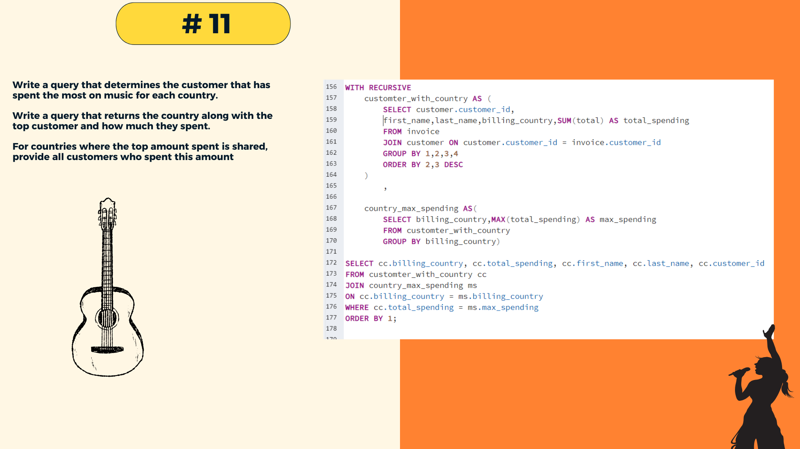

